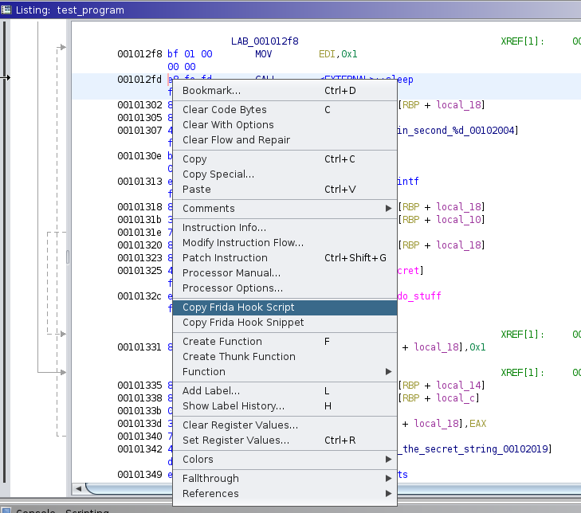

## Frida Hook generator for Ghidra

This plugin provides two new options in the right-click menu of the Listing Window in Ghidra:

- Copy Frida Hook Script: This one creates a valid frida script that generates a hook for the target address or function, and puts it into the clipboard. 
- Copy Frida Hook Snippet: This one creates a snippet that is meant to be put inside a generated script, and hooks the target address or function using the (assumed) predefined variables of that script. It is not a valid frida script in itself.

This extension supports both function-level hooking (when hooking the first address of a function), as well as arbitrary address hooking (when hooking inside a function).

It should be noted that the right-click should be done when hovering over the instruction address in the Listing Window. If for example it is done when hovering over a function name that the current instruction calls, the hook will be generated for that function, and not the current instruction.

#### Installation:

- Decompress the ghidra\_\<version\>\_PUBLIC\_\<date\>_frida_hook_generator.zip file which is inside dist/ , in a folder, named `frida_hook_generator`. 
- Change the extension.properties file inside that folder, to reflect your Ghidra version (if it is not 10.1.4)
- Ghidra (before opening a tool) -> File -> Install Extensions -> + sign -> Select the folder -> Make sure the frida_hook_generator is checked in the list of extensions
- Restart Ghidra
- Open CodeBrowser tool and analyze a binary. When asked if the new plugin should be configured, press "Yes" and make sure it is ticked. 

#### Usage:

- Open CodeBrowser tool and analyze a binary. If it is the first time after the installation, you will be asked if the new plugin should be configured. Press "Yes" and make sure it is ticked. 
- Right click at the Listing Window on an address and select one of the two Frida Hook available options.
- Paste the copied text into a file. Typically the first hook will be generated by the "Copy Script" option, and subsequent hooks by the "Copy Snippet" option.
- Run the binary through frida, for example `frida -f <binary> -l script.js --no-pause` 

#### Notes:

- The "Copy Script" option introduces a 2-second delay for registering the interceptors. The reason for that is that a typical mobile application will not have all the dynamic libraries readily available at launch, for frida to hook into. As a quick fix, the script waits for a little and then tries to register the interceptors.  In certain cases, this means that the functions may be executed before frida hooks on them. While there is a plan to implement a more automated way to register interceptors as soon as a library is loaded, a current solution would be to either reduce the wait delay, or manually find the position where the library is loaded, hook that, and at that point register the new interceptors.
- The generated script attempts to display a hooked function's parameters when it is called. However, usually the "Listing" window which contains the assembly code, does not reflect that parameter number. As such, the generated script will not contain code to print the correct number of parameters (usually it does not recognize any parameter, and as such it does not print anything). The solution to fix this is to right click on a function's name on the Ghidra "Decompiler" window, and select "Commit Params/Return". Then, the "Listing" window will recognize the correct number of parameters.
